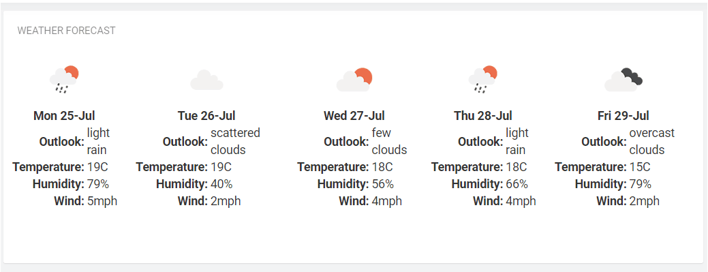

# Weather Forecast Widget for Cumulocity 

The Weather Forecast Widget is the Cumulocity module federation plugin created using c8ycli. This plugin can be used in Application Builder or Cockpit. 
The Weather Forecast Widget help you to Displays a 5-day weather forecast using weather data provided by the OpenWeatherAPI.

### Please choose Weather Forecast Widget release based on Cumulocity/Application builder version:

|APPLICATION BUILDER | CUMULOCITY  | Weather Forecast WIDGET |
|--------------------|-------------|-------------------------|
| 2.0.x              | >= 1016.x.x | 1.x.x                   |

## Prerequisites:
   Cumulocity c8ycli >=1016.x.x

## Features

**Realtime:** Realtime weather updates from the OpenWeatherAPI

**Configurable Refresh rate:** Control how often the weather updates

## Installation

### Runtime Widget Deployment?

* This widget supports runtime deployment. Download the [Runtime Binary](https://github.com/SoftwareAG/cumulocity-weather-forecast-widget-plugin/releases/download/1.0.0/sag-ps-pkg-weather-forecast-widget-1.0.0.zip)and install via Administrations --> Ecosystems --> Applications --> Packages 

## Quickstart

This guide will teach you how to add the widget in your existing or new dashboard.

1. Register a new account with [OpenWeather](https://openweathermap.org/)
2. Verify your openweathermap account by clicking on the email which has been sent to you
3. Log into your openweathermap account and add a new API under `API keys`
3. Open the Application Builder application from the app switcher (Next to your username in the top right)
4. Add a new dashboard or navigate to an existing dashboard
5. Click `Add Widget`
6. Search for `Weather Forecast`
7. See below for the configuration options

### Configuration options

1. Select your device in the `Target Assets or Devices` field
2. Enter the `API Key` which was generated in your openweathermap `API keys` page
3. Enter the `Refresh (in hours)` e.g. 1 
4. Enter the `City`. This is an optional field. The latitude and longitude of your selected device will be used if it has been configured.

   **Note** the City will default to London, if no city name is typed into this field and the selected device doesn't contain location (latitude & longitude) details. 

------------------------------

This Widget is provided as-is and without warranty or support. They do not constitute part of the Software AG product suite. Users are free to use, fork and modify them, subject to the license agreement. While Software AG welcomes contributions, we cannot guarantee to include every contribution in the master project.
_____________________
For more information you can Ask a Question in the [TECH Community Forums](https://tech.forums.softwareag.com/tag/Cumulocity-IoT).
